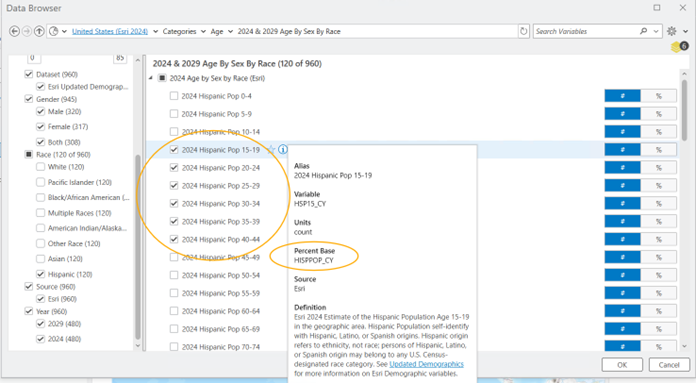
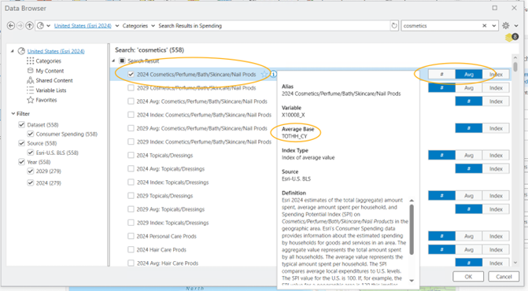
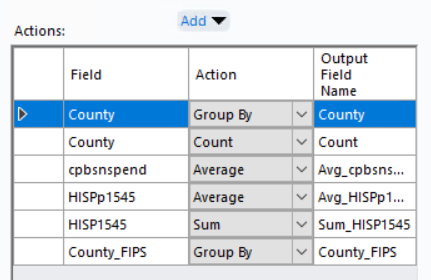
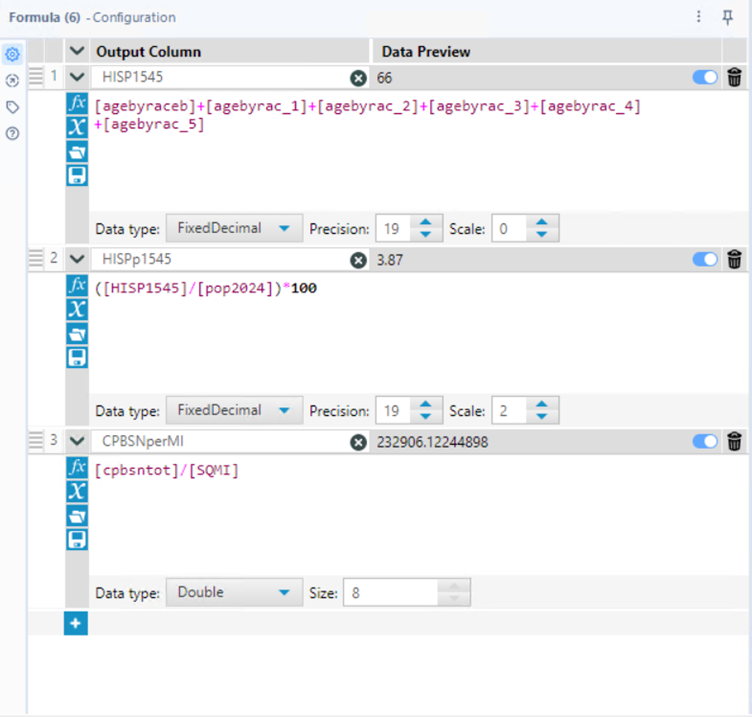

# Inclusive Skincare Access: A Geo-Demographic Micromarketing Project

This project uses data science, spatial analytics, and micromarketing to identify and prioritize outreach opportunities for inclusive skincare access among **Hispanic women aged 15–44**—a fast-growing, underrepresented demographic in the wellness space.

The initiative is built in phases, from high-level geographic targeting to trade area identification, lifestyle segmentation, and expansion modeling. Each phase combines real data with community-centered decision-making to drive impact where it matters most.

---

## 🗂️ 1. Project Workflow Overview

| Phase | Description | Status |
|-------|-------------|--------|
| ✅ Phase 1 | **State Selection** — Based on population concentration and skincare spending | Completed |
| ✅ Phase 2 | **ZIP-to-County Aggregation** — Identify top counties in New Mexico | Completed |
| ✅ Phase 3 | **Trade Area Definition** — Identify high-potential block groups | Completed |
| ✅ Phase 4 | **Retail Partner Selection & Buyer Estimation** | Completed |
| ✅ Phase 5 | **Lifestyle Segmentation** — Understand who lives there and how they shop | Completed |
| ⏳ Phase 6 | **Scalability Modeling** — Locate lookalike trade areas for expansion | Upcoming |

---

## 🔧 2. Tools & Data Sources

- **Alteryx Designer** – Data prep, enrichment, and spatial workflows  
- **Esri Demographics (2024)** – Population, age, ethnicity, and consumer spending data  
- **U.S. Census & Public Data** – FIPS, county/ZIP metadata  
- **ArcGIS Pro** – Mapping and spatial visualization

---

## 📍 Phase 1: State Selection Using Demographic and Spending Data

### 🎯 Objective

Pinpoint the best-fit U.S. state to launch inclusive skincare outreach, based on:
- Population size and percentage of Hispanic females aged 15–44
- Household-level skincare/cosmetics spending

---

### 🧮 Alteryx Calculations

#### 🔹 Total Count of Hispanic Women Aged 15–44  

#### 🔹 Percent of Total Population  

---

### 📊 Output: State-Level Summary  

---

### 🏁 Result: Why New Mexico?

New Mexico was selected due to:
- The **highest percentage** of the target group (10.29%)
- A strong raw count of **219,000+ Hispanic women aged 15–44**
- Solid skincare spend per household (~$210.74)

---

### 🖼 Variable Selection References

#### Hispanic Age Groups by Sex  

#### Skincare Spending Variable  

---

## 📍 Phase 2: ZIP-to-County Aggregation to Identify High-Impact Regions

### 🔧 Approach

- Enriched 348 ZIP codes in New Mexico with:
  - Hispanic female population (`HISP1545`)
  - % of ZIP population in user group (`HISPp1545`)
  - Average skincare spend (`cpbsnspend`)
- Joined ZIPs with metadata (city, county, FIPS)
- Grouped by county to calculate:
  - Total users
  - Average spend
  - Average target % population
  - ZIP count

---

### 📈 Key Insights

#### 🟢 Bernalillo County
- 74,602 target users
- 9.14% in user group
- $241.53 avg. skincare spend
- 22 ZIPs → scalable

#### 🟡 Dona Ana County
- 32,849 users
- Highest group concentration (15.51%)

---

### 📸 Visuals

#### Enriched ZIP Code Table  

#### County Summary from ZIP Aggregation  

#### Sorted by % of Target Group  

#### Sorted by Total Target Count  

---

### 🛠️ Alteryx Workflows

#### ZIP-to-County Enrichment Workflow  

#### County Aggregation Logic  

---

## 📍 Phase 3: Trade Area Definition – Identifying High-Potential Neighborhoods

### 🎯 Objective

Define high-density trade areas in **Bernalillo County** using block group data to:
- Focus efforts where target users are most concentrated
- Prioritize ZIPs like **87121** with the strongest metrics

---

### 📏 Filtering Logic

- Calculated summary statistics for `HISP1545` across block groups
- Set custom threshold:  
  `Avg (161.55) + 1 Std Dev (118.82) = ~280`
- Selected block groups with **≥280 Hispanic females aged 15–44**

---

### 📸 Visuals

#### Formula Tool for Trade Area Metrics  

#### Threshold Calculation from Profile Summary  

#### Filtered Trade Area Map + Workflow  

---

### 🗺 Target ZIP Visualization: 87121

#### Trade Area Map with ZCTA Pop-Up  

#### Map Legend  

---

### 💡 Insights

- ZIP 87121 includes both:
  - Dense, low-income areas (high density, lower HH spend)
  - Sparse, high-income areas (low density, higher HH spend)
- This diversity makes it ideal for layered outreach strategies in future phases

---

## 📍 Phase 4: Retail Partner Selection & Buyer Reach Estimation

### 🎯 Objective

Select the best beauty retail location in ZIP 87121 to serve as the outreach hub for distributing skincare kits and materials.

---

### 🛠️ Step 1: Retailer Address Preparation

#### Workflow  

---

### 🗺️ Step 2: Trade Area Mapping (1-Mile Radius, No Overlap)

#### Map  

---

### 📊 Step 3: Trade Area Comparison

#### Table  

- **Sunficent LLC** selected due to:
  - Highest projected spend: $1.69M
  - Strong per-household spend: $231.50
  - Good demographic alignment: 2,639 in target group

---

### 📈 Step 4: Buyer Estimation

#### Estimated Total Buyers  

- Based on $1,000 annual spend → **1,693 total buyers**

#### Estimated Buyers in Core Target Group  

- 13.59% of population = **~230 target users**

---

### 💡 Insights

- Sunficent LLC balances **reach, representation, and revenue**
- It will serve as the pilot site for inclusive skincare outreach

---

## 📍 Phase 5: Lifestyle Segmentation – Understanding & Scaling User Profiles

### 🎯 Objective

Now that we’ve identified Sunficent LLC as our most strategic retail hub, the next goal was to:
- Understand **who** lives in this trade area
- Identify **behavioral trends** via Esri’s Tapestry segments
- Use this intel to **tailor messaging** and explore **expansion opportunities**

---

### 🗺️ Trade Area Lifestyle Map

---

### 🛠️ Alteryx Workflow for Enriched Segments

---

### 📊 Top Lifestyle Segments in the Trade Area

| Segment | Description | Households | Percent |
|---------|-------------|------------|---------|
| 7A | Up and Coming Families | 3,178 | 43.4% |
| 8C | Bright Young Professionals | 1,080 | 14.8% |
| 4A | Workday Drive | 1,077 | 14.7% |
| 4B | Home Improvement | 718 | 9.8% |
| 8E | Front Porch | 512 | 7.0% |
| 11C | Metro Fusion | 558 | 7.6% |

#### Household Counts  

#### Segment Percentages  

---

### 🌟 Focus Segment: 7A – Up and Coming Families

- Young, budget-conscious families
- Median age: 31.4  
- Median income: $72,000  
- Tech-savvy, brand-aware, value-driven

---

### 🧬 Lifestyle Snapshot: 7A – Up and Coming Families

  
  

---

### 💡 Insights

- 7A aligns with outreach goals in both **life stage** and **media habits**
- Data guides future **expansion to ZIPs** with similar segment presence

---

## 📫 8. Let’s Connect

**Created by:** Pratiksha Gund  
🔗 [LinkedIn](https://www.linkedin.com/in/your-handle)  
🌐 [Portfolio](https://your-site.com)  
📧 [Email](mailto:your.email@example.com)

---

**Tags:**  
#Alteryx #GIS #ConsumerAnalytics #InclusiveBeauty #DataForGood #Micromarketing #RetailStrategy

_Last updated: July 20, 2025_
