# Inclusive Skincare Access: A Geo-Demographic Micromarketing Project

This project uses data science, spatial analytics, and micromarketing to identify and prioritize outreach opportunities for inclusive skincare access among **Hispanic women aged 15–44**—a fast-growing, underrepresented demographic in the wellness space.

The initiative is built in phases, from high-level geographic targeting to trade area identification, lifestyle segmentation, and expansion modeling. Each phase combines real data with community-centered decision-making to drive impact where it matters most.

_Last updated: July 20, 2025_

---

## 🗂️ Project Workflow Overview

| Phase | Description | Status |
|-------|-------------|--------|
| ✅ Phase 1 | State Selection — Based on population concentration and skincare spending | Complete |
| ✅ Phase 2 | ZIP-to-County Aggregation — Identify top counties in New Mexico | Complete |
| ✅ Phase 3 | Trade Area Definition — Identify high-potential block groups | Complete |
| ✅ Phase 4 | Retail Partner Selection & Buyer Estimation | Complete |
| ✅ Phase 5 | Lifestyle Segmentation — Understand who lives there and how they shop | Complete |
| ✅ Phase 6 | Expansion Modeling — Locate lookalike trade areas | Complete |

---

## 🔧 Tools & Data Sources

- **Alteryx Designer** — For data prep, spatial analytics, enrichment, segmentation
- **ArcGIS Pro** — For geospatial analysis and trade area visualization
- **Esri Demographics (2024)** — Age, race, spending, lifestyle segments
- **U.S. Census / FIPS / ZIP shapefiles**
- **ParseHub + Yellow Pages** — Web scraping for retail locations

---

## 📍 Phase 1: State Selection Using Demographic and Spending Data

**Goal:** Identify the U.S. state where skincare outreach to Hispanic women aged 15–44 can have the highest impact.

### Alteryx Formulas

- **Raw Count (HISP1545)**  
  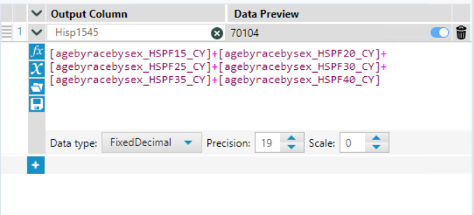

- **Percent of Population (HISPp1545)**  
  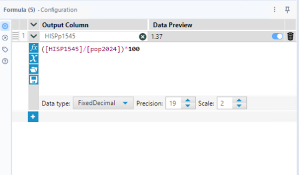

---

### Output: State-Level Summary  
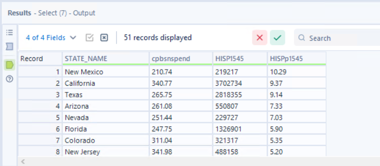

**New Mexico selected** due to:
- Highest % of Hispanic females aged 15–44 (10.29%)
- Strong raw count (219,000+)
- Moderate but significant skincare spend ($210.74 per household)

---

## 📍 Phase 2: ZIP-to-County Aggregation

**Goal:** Identify New Mexico counties with the highest opportunity for outreach.

### Alteryx Workflows  
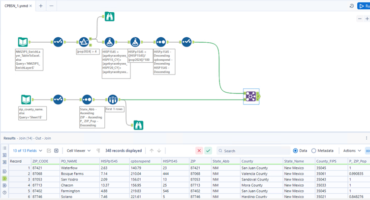  
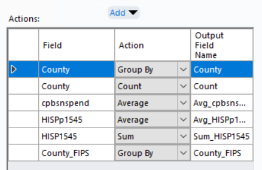

---

### Output Table  

### County Rankings  
- **Bernalillo County**: 74,602 women in target group  
- **Dona Ana County**: Highest % (15.51%)  
  
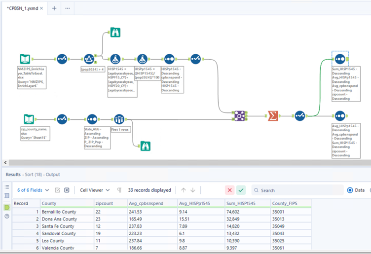

---

## 📍 Phase 3: Trade Area Definition

**Goal:** Identify block groups with ≥280 Hispanic females aged 15–44 using Esri & census data.

### Threshold Calculation  
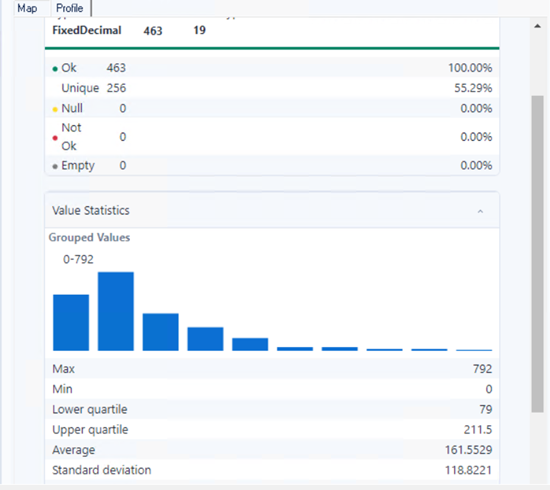

### Filtered Block Groups  
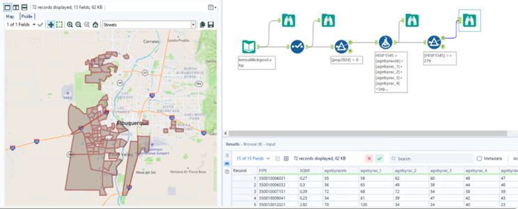

---

### ZIP Focus Map (87121)  
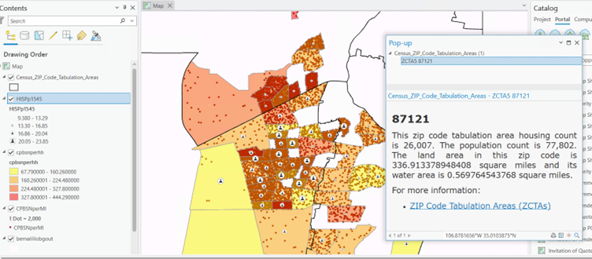  
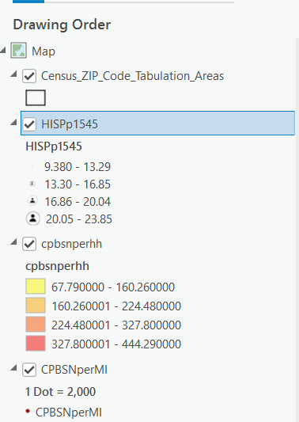

---

## 📍 Phase 4: Retail Partner Selection & Buyer Estimation

**Goal:** Select best retail hub in ZIP 87121 using spend, reach, and user-group density.

### Workflow & Store Comparison  
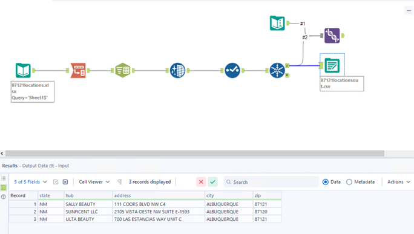  
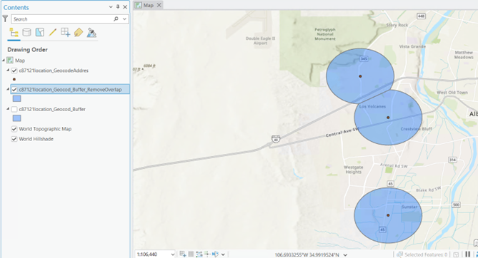  
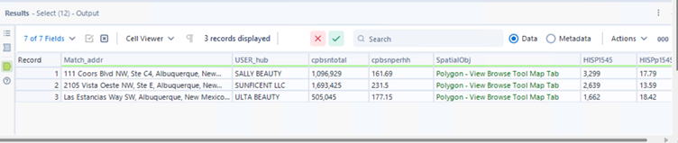

---

### Buyer Estimations  
- **Total Buyers (based on $1,000/yr spend):**  
  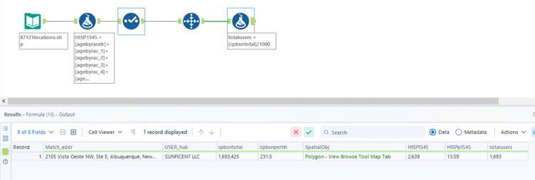

- **Target Group Buyers (Hispanic females 15–44):**  
  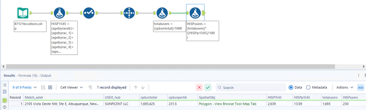

---

## 📍 Phase 5: Lifestyle Segmentation – Behavioral Targeting

**Goal:** Understand the dominant lifestyle segments in our best-performing trade area.

### Map: Esri Tapestry Segments  
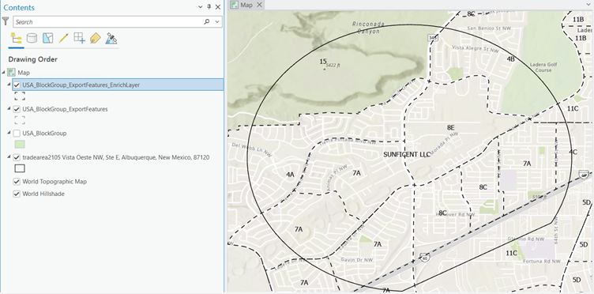

### Alteryx Workflow  
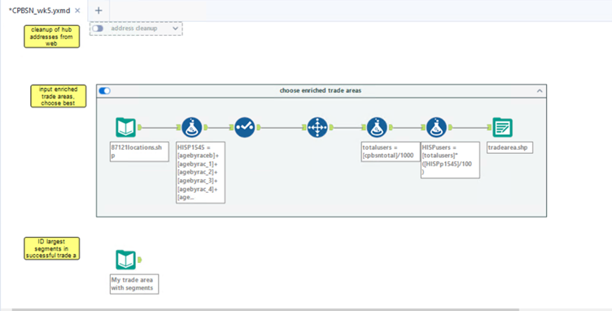

---

### Segment Breakdown

| Segment | Households | % of Total |
|---------|------------|------------|
| 7A: Up and Coming Families | 3,178 | 43.4% |
| 8C: Bright Young Professionals | 1,080 | 14.8% |
| 4A: Workday Drive | 1,077 | 14.7% |
| 4B: Home Improvement | 718 | 9.8% |
| 8E: Front Porch | 512 | 7.0% |
| 11C: Metro Fusion | 558 | 7.6% |

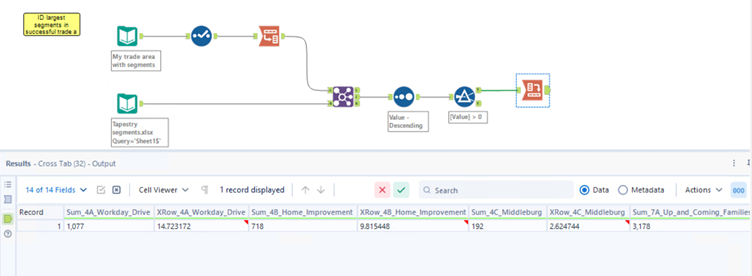  
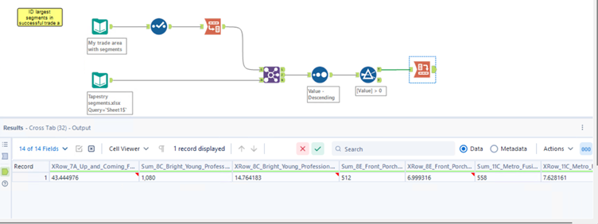

---

### Segment Profile: 7A – Up and Coming Families

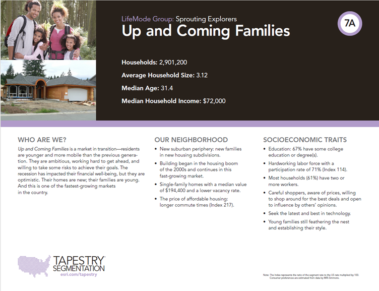  
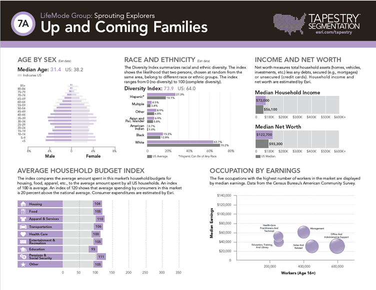  
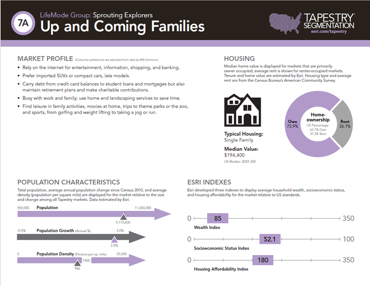

---

## 📍 Phase 6: Expansion Modeling – Identifying Lookalike Trade Areas

**Goal:** Identify new skincare retail sites in nearby ZIPs that also attract high-density 7A populations.

---

### Step 1: Scrape Nearby Cosmetic Stores

> Extracted skincare/cosmetic stores near ZIP 87120 using ParseHub + Yellow Pages for trade area testing.

---

### Step 2: Clean and Parse Address Data

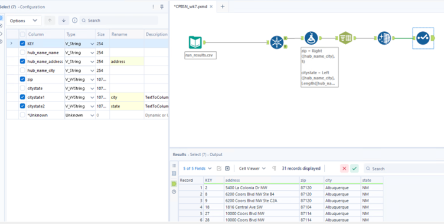

---

### Step 3: Trade Area Evaluation by 7A Households

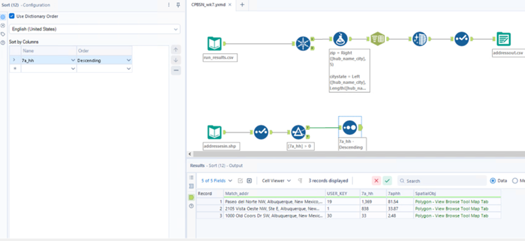

> **Top Expansion Site: Paseo del Norte NW**  
> - 1,369 households in 7A (81.54%)  
> - Higher concentration than Sunficent LLC (833, 38.37%)  
> - Old Coors Dr SW less promising (30 households, 2.48%)

---

## 💬 Final Thoughts

This project models how micromarketing + spatial analysis can power **inclusive wellness outreach** using real demographic and consumer behavior data.

The final phase will explore **campaign modeling and impact estimation** for each selected area.

---

## 👤 Author

**Pratiksha Gund**  
📍 Data Analyst | Micromarketing Researcher  
🔗 [LinkedIn] (https://www.linkedin.com/in/pratiksha-gund/) | 🌐 [Portfolio] | ✉️ [Email] (pratikshagund10@gmail.com)

---

## 🏷 Tags

#Micromarketing #GIS #RetailAnalytics #Alteryx #ArcGIS #DataForGood #ConsumerInsights #InclusiveSkincare #BehavioralTargeting #TradeAreaModeling
